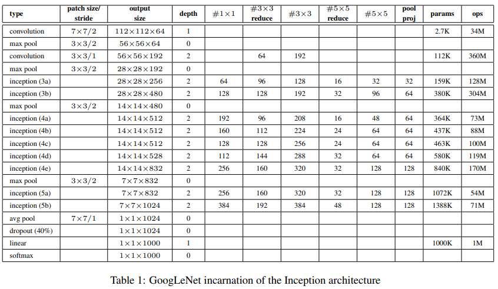
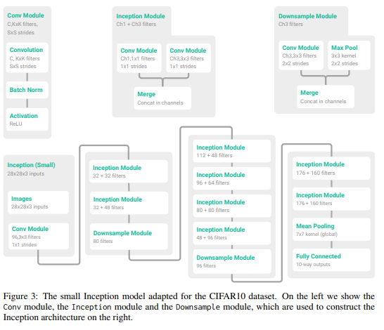
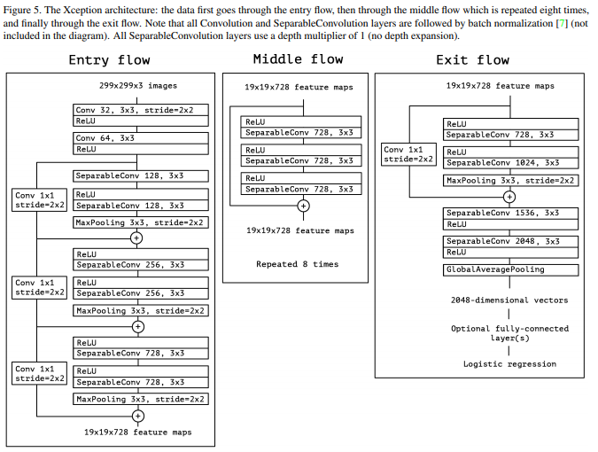
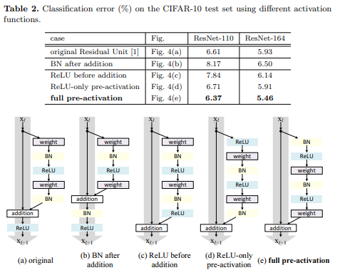

# Convolutional Neural Network

This repository is to introduce some classic CNN models. Also, their variants or customized version of them are discussed. 

Most of their architecture are structured for the shape of various image datasets, such as ImageNet or cifar. 
Their architectures are customizable with these modules in this repository.

You will be able to build original or customized version of the classic CNN models, train, evaluate, and predict them with the modules. 

They are developed with Keras. 

# Models

1. [Lenet](#Lenet)
2. [Alexnet](#Alexnet)
3. [Network In Network](#NIN)
4. [VGG](#VGG)
5. [GoogLeNet](#GoogLeNet)
6. [Xception](#Xception)
7. [Resnet](#Resnet)


## Lenet
* [Lenet Paper](http://yann.lecun.com/exdb/publis/pdf/lecun-01a.pdf)

* You can customize..
    - activation
    - weight initializer
    - regularizer
    - optimizer
    - structure (depends on the input shape)
    
* Original Architecture

|Layer           |Maps   |Size   |Kernel Size|stride |Activation|
|----------------|:-----:|:-----:|:---------:|:-----:|:--------:|
|Input           |1      |32 x 32|           |       |          |
|Conv5-6         |6      |28 x 28|5 x 5      |1      |tanh      |
|Avg Pooling2D   |6      |14 x 14|2 x 2      |2      |          |
|Conv5-16        |16     |10 x 10|5 x 5      |1      |tanh      |
|Avg Pooling2D   |16     |5 x 5  |2 x 2      |2      |          |
|Conv5-120       |120    |1 x 1  |5 x 5      |1      |tanh      |
|FC              |       |84     |           |       |tanh      |
|FC              |       |10     |           |       |softmax   |


## Alexnet
* [Alexnet Paper](https://papers.nips.cc/paper/4824-imagenet-classification-with-deep-convolutional-neural-networks.pdf)

The input shape that is stated in the paper is 224 x 224 x 3, but it must be 227 x 227 x 3 as stated in [cs231n](https://cs231n.github.io/convolutional-networks/)

* You can customize..
    - activation
    - weight initializer
    - regularizer
    - optimizer

* Two versions of Alexnet available
    1. Orginial version
    2. Mini version


* Original Architecture

|Layer               |Maps |Size     |Kernel Size|Strides|Activation|
|:------------------:|:---:|:-------:|:---------:|:-----:|:--------:|
|Input               |3    |227 x 227|           |       |          |
|Conv11-96 (BN, Act) |96   |55 x 55  |11 x 11    |4      |relu      |
|MaxPooling          |96   |27 x 27  |3 x 3      |2      |relu      |
|Conv5-256 (BN, Act) |256  |27 x 27  |5 x 5      |1      |relu      |
|MaxPooling          |256  |13 x 13  |3 x 3      |2      |relu      |
|Conv3-384 (Act)     |384  |13 x 13  |3 x 3      |1      |relu      |
|Conv3-384 (Act)     |384  |13 x 13  |3 x 3      |1      |relu      |
|Conv3-256 (Act)     |256  |13 x 13  |3 x 3      |1      |relu      |
|MaxPooling          |256  |6 x 6    |3 x 3      |2      |relu      |
|FC(Dropout)         |     |4096     |           |       |relu      |
|FC(Dropout)         |     |4096     |           |       |relu      |
|FC                  |     |1000     |           |       |softmax   |


* Mini version Architecture

|Layer             |Maps|Size   |Kernel Size|Strides|Activation|
|:----------------:|:--:|:-----:|:---------:|:-----:|:--------:|
|Input             |3   |32 x 32|           |       |          |
|Conv3-64 (BN,Act) |64  |16 x 16|3 x 3      |2      |relu      |
|MaxPooling        |64  |8 x 8  |2 x 2      |2      |relu      |
|Conv3-192 (BN,Act)|192 |8 x 8  |3 x 3      |1      |relu      |
|MaxPooling        |192 |4 x 4  |2 x 2      |2      |relu      |
|Conv3-256 (Act)   |256 |4 x 4  |3 x 3      |1      |relu      |
|Conv3-256 (Act)   |256 |4 x 4  |3 x 3      |1      |relu      |
|MaxPooling        |256 |1 x 1  |2 x 2      |2      |relu      |
|FC(Dropout)       |512 |       |           |       |relu      |
|FC(Dropout)       |256 |       |           |       |relu      |
|FC                |10  |       |           |       |softmax   |


Note: Batch Normalization is used instead of LRN introduced in the paper at the first and the second conv layer. 
Dropout : 0.5

## NIN

* [Network In Network Paper](https://arxiv.org/pdf/1312.4400.pdf)

* You can customize..
    - activation
    - weight initializer
    - regularizer
    - optimizer
    - structure (depends on input shape)
    
For structure of customized NIN, you will be structuring modules called the mlpconv blocks and connect along them to build whole model. Examples are implemented in the code. 


* mlpconv layers

The structure of mlpconv layers are similar to the below


|Layer               |Maps|Kernel Size |
|:------------------:|:--:|:----------:|
|...Previous layers..|....|            |
|Conv  (BN, Act)     |....|first kernel|
|Conv  (BN, Act)     |....|1 x 1       |
|Conv  (BN, Act)     |....|1 x 1       |
|MaxPooling          |....|3 x 3       |
|Dropout             |    |            |

Note: 
1. first kernel has to be defined
2. For the last mlpconv layers, it takes Global Avg Pooling instead of Max Pooling, and Activation would be softmax.  

The structure of NIN model for cifar10 dataset as an example would be


|Structure                 | Layers               |
|:------------------------:|:--------------------:|
|Input (32 x 32 RGB)       |Input                 |
|mlpconv layers 1 (BN, Act)|Conv5-192 (filters : 192, kernel : 5)     |
|                          |Conv1-160             |
|                          |Conv1-96              |
|                          |MaxPooling            |
|                          |Dropout(0.5)          |
|mlpconv layers 2 (BN, Act)|Conv5-192             |
|                          |Conv1-192             |
|                          |Conv1-192             |
|                          |MaxPooling            |
|                          |Dropout(0.5)          |
|mlpconv layers 3 (BN, Act)|Conv3-192             |
|                          |Conv1-192             |
|                          |Global Avg Pooling    |
|                          |Activation (Softmax)  |


## VGG

* [VGG Paper](https://arxiv.org/pdf/1409.1556.pdf)

* You can customize..
    - activation
    - weight initializer
    - regularizer
    - optimizer
    
You will be able to select version of VGG in the following: 11, 13, 16, 19


The structure of each versions are defined as below:


|      11    |  13        |  16        |  19        |
|:----------:|:----------:|:----------:|:----------:|
|Conv3-64    |Conv3-64    |Conv3-64    |Conv3-64    |
|            |Conv3-64    |Conv3-64    |Conv3-64    |
|Max pooling |Max pooling |Max pooling |Max pooling |
|Conv3-128   |Conv3-128   |Conv3-128   |Conv3-128   |
|            |Conv3-128   |Conv3-128   |Conv3-128   |
|Max Pooling |Max Pooling |Max pooling |Max pooling |
|Conv3-256   |Conv3-256   |Conv3-256   |Conv3-256   |
|Conv3-256   |Conv3-256   |Conv3-256   |Conv3-256   |
|            |            |Conv3-256   |Conv3-256   |
|            |            |            |Conv3-256   |
|Max Pooling |Max Pooling |Max pooling |Max pooling |
|Conv3-512   |Conv3-512   |Conv3-512   |Conv3-512   |
|Conv3-512   |Conv3-512   |Conv3-512   |Conv3-512   |
|            |            |Conv3-512   |Conv3-512   |
|            |            |            |Conv3-512   |
|Max Pooling |Max Pooling |Max pooling |Max pooling |
|Conv3-512   |Conv3-512   |Conv3-512   |Conv3-512   |
|Conv3-512   |Conv3-512   |Conv3-512   |Conv3-512   |
|            |            |Conv3-512   |Conv3-512   |
|            |            |            |Conv3-512   |
|Max pooling |Max pooling |Max pooling|Max pooling |
|FC-4096     |FC-4096     |FC-4096     |FC-4096     |
|FC-4096     |FC-4096     |FC-4096     |FC-4096     |
|FC-1000     |FC-1000     |FC-1000     |FC-1000     |
|Activation(Softmax)|Activation(Softmax)|Activation(Softmax)|Activation(Softmax)|


## GoogLeNet

* [GoogLeNet paper](https://arxiv.org/pdf/1409.4842.pdf)

* You can customize..
    - activation
    - weight initializer
    - regularizer
    - optimizer

* Two versions of Googlenet available
    1. Orginial version
    2. Mini version

Note: Mini version is structured as stated in the paper, [Mini Googlenet](https://arxiv.org/pdf/1611.03530.pdf)


* Original Architecture (from the paper)



* MiniGooglenet Architecture




## Xception

* [Xception paper](https://arxiv.org/pdf/1610.02357.pdf)

* You can customize..
    - activation
    - weight initializer
    - regularizer
    - optimizer
    - structure (depends on input shape)
    
Note: For structure of customized Xception, you will be structuring modules called flow and connect along them to build whole model. Examples are implemented in the code.


* Original Architecture




* Customized mini version of Xception was implemented in the code

Reference : [Mini Xception](https://github.com/beinanwang/tf-slim-xception-cifar-10)


## Resnet


* [Resnet Paper](https://arxiv.org/pdf/1512.03385.pdf)
* [Resnet v2 Paper](https://arxiv.org/pdf/1603.05027.pdf)


* You can customize..
    - activation
    - weight initializer
    - regularizer
    - optimizer
    - structure (depends on input shape)
    
Note: You can build various Resnets with the module, such as from Resnet18 to Resnet152. 


* Simple Example as Keras Resnet implementation 
[Keras Resnet Implementation](https://keras.io/examples/cifar10_resnet/)


* Version 1 Residual Module : stacks of (3 x 3) - (3 x 3)

* Example : (3 x 3, 16) x 2 - (3 x 3, 32) x 2 , Input 32 x 32 RGB


|                    |Input (32 x 32 RGB image)|        | 
|:------------------:|:-----------------------:|:------:|
|                    |conv3-16, stride 1       |        |
|                    |First Module starts(3 x 3, 16)|   |
|                    |BN1                      |        |
|                    |Act1                     |        |
|c1 3x3, 16 (BN, Act)|                         |        |
|c2 3x3, 16 (BN)     |                         |        |
|                    |Add1 (c2, Act1)          |        |
|                    |Second Module starts(3 x 3, 16)|  |
|                    |Act2                     |        |
|c1 3x3, 16 (BN, Act)|                         |        |
|c2 3x3, 16 (BN)     |                         |        |
|                    |Add2 (c2, Act2)          |        |
|                    |First Module starts(3 x 3, 32)|   |
|                    |Act3                     |        |
|c1 3x3, 32 (BN, Act)|                         |        |
|c2 3x3, 32 (BN)     |                         |identity c1 1x1, 32 strides 2 (from Act3)|
|                    |Add3 (c2, identity c1)   |        |
|                    |Second Module starts(3 x 3, 32)|  |
|                    |Act4                     |        |
|c1 3x3, 32 (BN, Act)|                         |        |
|c2 3x3, 32 (BN)     |                         |        |
|                    |Add4 (c2, Act4)          |        |

And so on.. 

* This is the same model with the version 1 in Keras implementation

```python
resnet30 = resnet(input_shape = (32,32,3), y_shape = 1, activation = 'relu', num_class = 10, kernel_regularizer = keras.regularizers.l2(weight_decay), kernel_initializer = 'he_normal')

resnet30.build_custom_resnet(filter_structure = [16, 32, 64], structure_stack = [3,3,3], start_filter = 16, start_kernel = 3, start_strides = 1)
```


* Version 2 Residual Module : stacks of (1 x 3 x 1), known as bottleneck layer

* Example : (1 x 3 x 1, (16, 64)) x 2 - (1 x 3 x 1, (64, 128)) x 2, Input 32 x 32 RGB

In the [paper](https://arxiv.org/pdf/1603.05027.pdf), the location of BN and Activation layer in the bottleneck layers were importantly discussed.

* Full pre-activation




|                      |Input (32 x 32 RGB image)  |             | 
|:--------------------:|:-------------------------:|:-----------:|
|                      |conv3-16, stride 1         |             |
|                      |First Module starts(1 x 3 x 1, (16,64))  |        |
|                      |BN1                        |             |
|                      |Act1                       |             |
|c1 1 x 1, 16 (BN, Act)|                           |             |
|c2 3 x 3, 16 (BN, Act)|                           |             |
|c3 1 x 1, 64          |                           |identity c1 1 x 1, 64 strides 1 (from Act1)|
|                      |Add1 (c3, identity c1), 64 |             |
|                      |Second Module starts(1 x 3 x 1, (16,64)) |        |
|BN2                   |                           |             |
|Act2                  |                           |             |
|c1 1 x 1, 16 (BN, Act)|                           |             |
|c2 3 x 3, 16 (BN, Act)|                           |             |
|c3 1 x 1, 64          |                           |             |
|                      |Add2 (c3, Add1), 64        |             |
|                      |First Module starts(1 x 3 x 1, (64,128)) |        |
|BN3                   |                           |             |
|Act3                  |                           |             |
|c1 1 x 1, 64 (BN, Act) strides 2|                 |             |
|c2 3 x 3, 64 (BN, Act)|                           |             |
|c3 1 x 1, 128         |                           |identity c2 1 x 1, 128 strides 2 (from Add2)|
|                      |Add3 (c3, identity c2), 128|             |
|                      |Second Module starts(1 x 3 x 1, (64,128))|        |
|BN4                   |                           |             |
|Act4                  |                           |             |
|c1 1 x 1, 64 (BN, Act)|                           |             |
|c2 3 x 3, 64 (BN, Act)|                           |             |
|c3 1 x 1, 128         |                           |             |
|                      |Add2 (c3, Add3), 128       |             |

And so on.. 

Notice the location of the BatchNormalization and Activation layers in the modules. 


* This is the same model with the version 2 in the Keras implementation

```python
resnet30_ver2 = resnet(input_shape = (32,32,3), y_shape = 1, activation = 'relu', num_class = 10, kernel_regularizer = keras.regularizers.l2(weight_decay), kernel_initializer = 'he_normal')

resnet30_ver2.build_custom_resnet(filter_structure = [16,64,128], filter_structure2 = [64, 128, 256], structure_stack = [3,3,3], start_filter = 16, start_kernel = 3, start_strides = 1)
```